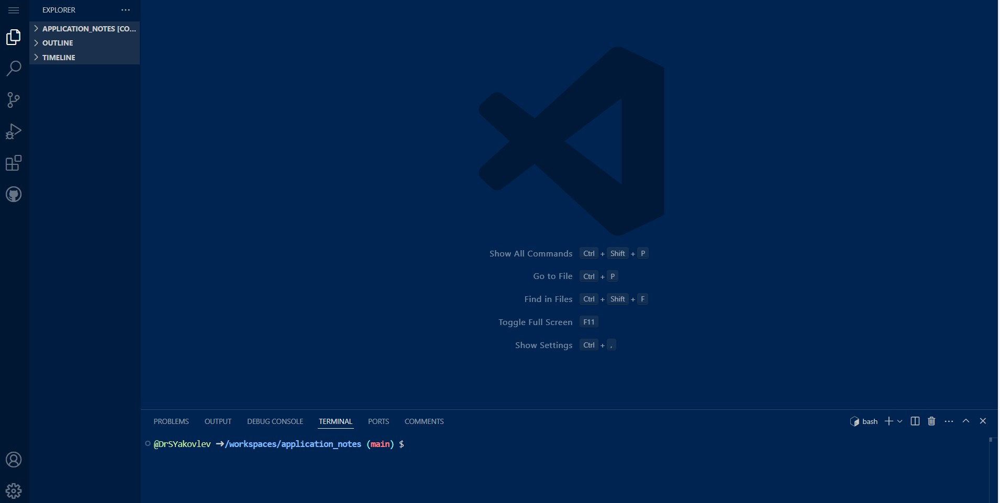
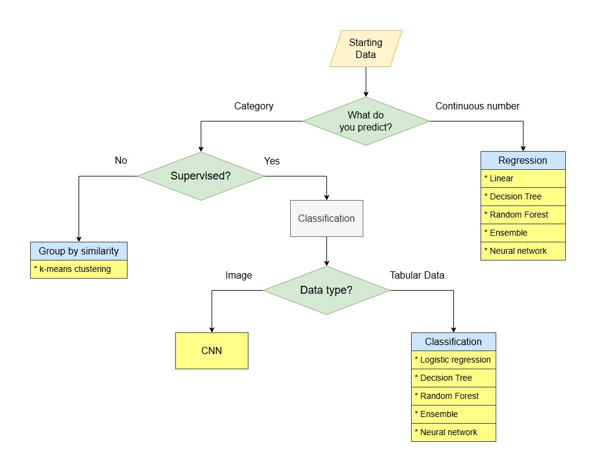

# ml-template-images

## Description
This repo collects guidelines and useful links and sources for a ML student project using images as input data. The structure and content of the Jupyter notebooks represent a very high-level outline of a student ML project and should not be considered as an exact recipe.

## Setting up your workspace
1. Register and create an account on [GitHub](https://github.com/). **Familiarise youself with this resource as it is going to be the main place for code storage and version control.**
2. Create **public** repo on GitHub, give it a sensible name, make sure you include README.md.
3. Open your repository, click on the **Code** green button, select 'Codespaces' tab and click 'Create codespace on master'. Codespace looking something like this:

will be created. The colour theme may be different and can be configured.

4. Create jupyter_notebooks folder. This can be done via project explorer of terminal using command line.
5. In this folder create 1_data_collection.ipynb file. There will be more Jupyter notebooks in the project covering the entire ML pipeline. File format *.ipynb will authomatically be recognised as Jupyter Notebook.
6. Open this notebook and select jupyter kernel. **You need to choose Python**
7. In the project root directory create two files:
- .gitignore
(to list files/folders not to be pushed to GitHub due to size limitation or sensitive information, such as secret keys)
**!!Do not push databases (datasets) or any other large files (>100MB) to GitHub. Store them locally with the backup copy on an external storage!!**
- requirements.txt (to list packages required to run the project and indicate their versions for compatibility)
8. **Familiarise yourself with the [Jupyter Notebok](https://jupyter.org/) as it is going to be your main development tool in this project.**

Your are now pretty much set to start your ML journey.

N.b. There are other options for creating your coding environmeng (see [Useful links](#useful-links)).

## Data acquisition
In this project you will obtain dataset (fitting the context of your project context) from [Kaggle](https://www.kaggle.com/)

## ML pipeline concept

**ML pipeline** is the core concept in the field of ML and it is particularly important for tabular data. It is therefore critical to understand all steps which it follows. The is a huge number of books and online sources you can use.

## CRISP-DM

The **Cross-industry standard process for data mining**, known as **CRISP-DM**, is an open standard process model that describes common approaches used by data mining experts. It is the most widely-used analytics model [Wiki](https://en.wikipedia.org/wiki/Cross-industry_standard_process_for_data_mining). Get understanding of the workflow and main steps.

## Model selection

Use the diagram below to select an appropriate ML model:

## Required libraries

Essential Python libraries:

[NumPy](https://numpy.org/)

[Pandas](https://pandas.pydata.org/)

[MatPlotLib](https://matplotlib.org/)

[Feature-Engine](https://feature-engine.trainindata.com/en/latest/)

[Scikit-learn](https://scikit-learn.org/stable/index.html)

[TensofFlow](https://www.tensorflow.org/)

[Keras](https://keras.io/)

Depending on the scope of your project, you will not need all these packages or you might need something else which is not in this list.

## 'jupyter_notebooks' folder structure

Jupyter notebooks are collected in [separate](/workspaces/ml-template-tabular/jupyter_notebooks). Their names and sequential numbers follow the steps dictated by a structure of typical ML pipeline and CRISP-DM methodology. Depending on the data type and project scope and context, the structure can change a bit but it is recommended to always follow this logic in your project.

## Useful links
[Markdown on GitHub](https://docs.github.com/en/get-started/writing-on-github/getting-started-with-writing-and-formatting-on-github/basic-writing-and-formatting-syntax)

[Conventional commits](https://www.conventionalcommits.org/en/v1.0.0/)

[Codeanywhere](https://www.codeanywhere.com/)

[Gitpod](https://www.gitpod.io/)

## Where to search for help if you are stuck

[Stack Overflow](https://stackoverflow.com/)

[Discussion section on Kaggle](https://www.kaggle.com/discussions)

[w3c](https://www.w3schools.com/python/)

### Git commands:
#### Usually go in sequence:
---
`git add --all`
(or `git add .`) (add changes to the commit)

`git commit -m "add commit message here"` (commit changes)

`git push` (push to GitHub)

---

`git status` (check current commit status)

## Credits
**It is ok to reuse someone else's code. It is absolutely not ok to keep quiet about it.**